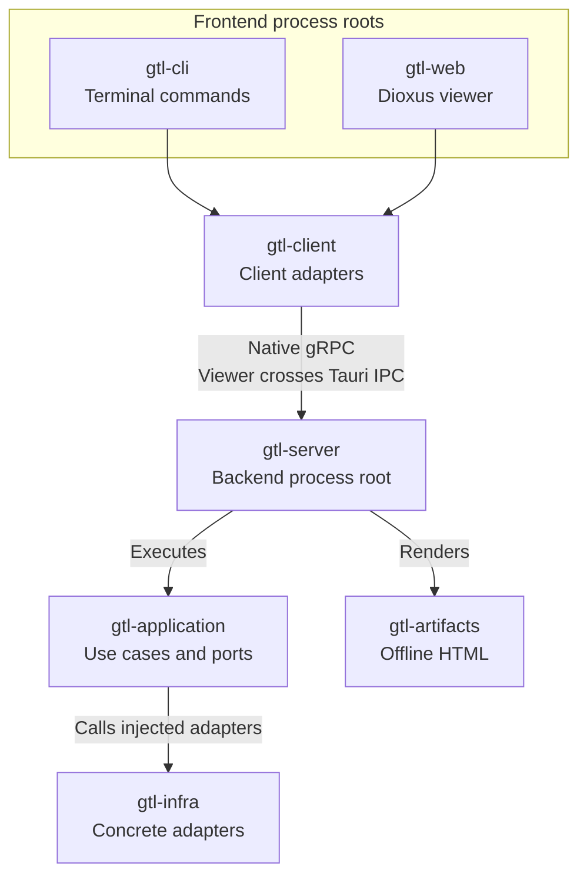
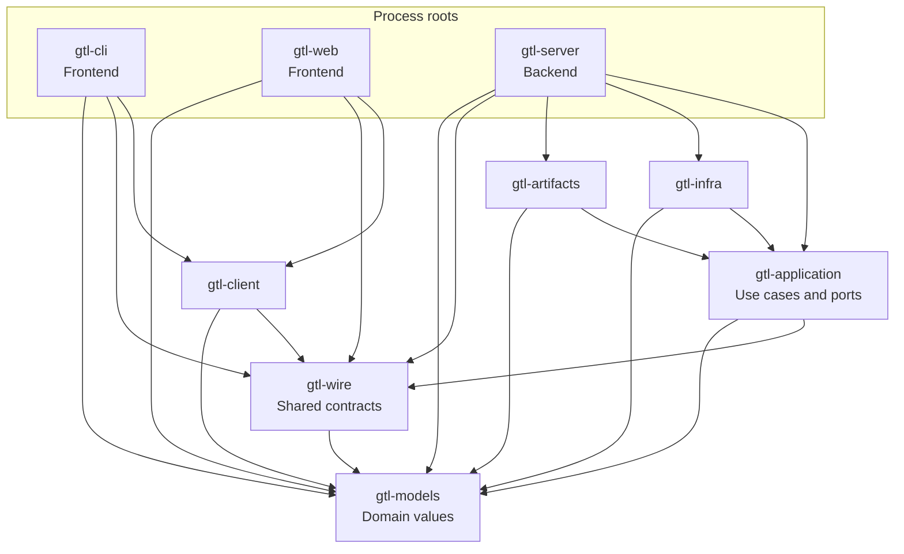

# Design

git-tools was built to keep the overhead of reviewing and updating repositories low.

I wanted to review local changes and unpushed commits in one place, then use the same commands
when working with nested repositories or a set of projects.

The app runs locally. A background server keeps the project catalogue, settings and diff
history so the CLI and viewer use the same data.

## Runtime overview

`gtl-cli` and `gtl-web` are frontend process roots: they translate terminal or viewer input into client requests and present results.
`gtl-server` is the backend process root: it wires concrete adapters, serves requests, and executes application operations.
Viewer requests cross the Tauri host before native gRPC reaches the server; the host is omitted from this overview.

## Crate dependencies

`A → B` means crate A directly depends on crate B in Cargo.
This graph shows normal dependencies between the nine overview crates; dependencies on other workspace crates and external libraries are omitted.
Runtime calls above do not imply Cargo dependencies.

## Crate roles

| Crate | Responsibility |
| --- | --- |
| `gtl-cli` | Frontend process root: parse CLI intent, prompt, format output, and choose exit status |
| `gtl-web` | Frontend process root: Dioxus routes, temporary UI state, and diff presentation |
| `gtl-server` | Backend process root: adapter composition, application execution, services, and viewer launch |
| `gtl-infra` | Concrete Git, persistence, filesystem, clock, and OS adapters |
| `gtl-models` | Domain values and typed failures |
| `gtl-wire` | Shared operation contracts and optional protobuf and gRPC codecs |
| `gtl-client` | Native gRPC and WebView IPC clients; typed failure decoding |
| `gtl-application` | Git use cases, viewer sessions, cache, diff projection, and capability ports |
| `gtl-artifacts` | Static HTML rendering, styles, and asset safety |
